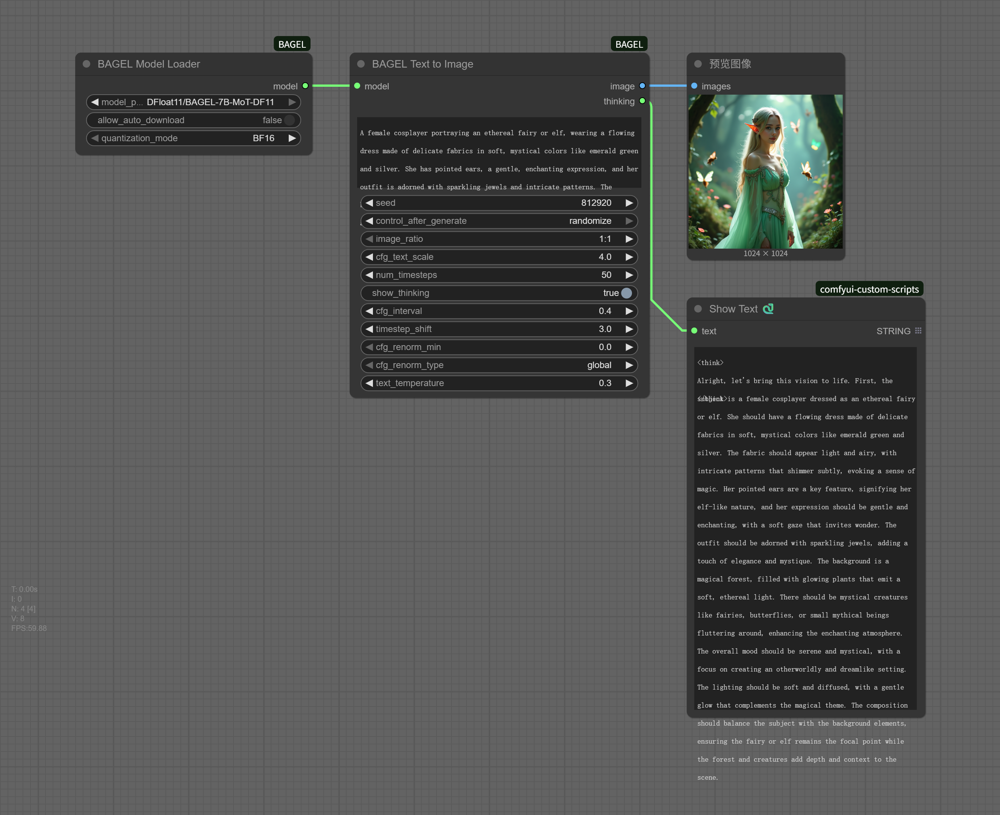

# ComfyUI-Bagel

A ComfyUI custom node package based on the BAGEL-7B-MoT multimodal model.

## About BAGEL

<p align="center">
  
</p>

BAGEL is an open-source multimodal foundation model with 7B active parameters (14B total) that adopts a Mixture-of-Transformer-Experts (MoT) architecture. It is designed for multimodal understanding and generation tasks, outperforming top-tier open-source VLMs like Qwen2.5-VL and InternVL-2.5 on standard multimodal understanding leaderboards, and delivering text-to-image quality competitive with specialist generators such as SD3.

## Features

- **Text-to-Image Generation**: Generate high-quality images using natural language prompts
- **Image Editing**: Edit existing images based on textual descriptions  
- **Image Understanding**: Perform Q&A and analysis on images
- **Reasoning Process Display**: Optionally display the model's reasoning process
- **Advanced Quantization Support**: Multiple quantization modes (BF16, NF4, INT8) for the standard model
- **DFloat11 Quantized Model Support**: Pre-quantized model requiring only ~22GB VRAM for single GPU setups

## Installation

### 1. Model Selection and Download
The ComfyUI-Bagel node provides a model selection dropdown with automatic downloading capabilities:
- **Model Selection UI**: Choose from available Hugging Face repository IDs or local folder names in the dropdown
- **Auto-download Feature**: When `allow_auto_download` is enabled, models are automatically downloaded to `models/bagel/` on first use
- **Local Model Detection**: The node automatically scans for locally installed models in the `models/bagel/` directory

**Available Models:**
- **ByteDance-Seed/BAGEL-7B-MoT**: Standard model with multiple quantization options
  - **BF16**: Full precision mode (~80GB VRAM recommended for multi-GPU)
  - **NF4**: 4-bit quantization (~12-32GB VRAM, highly recommended for single GPU)
  - **INT8**: 8-bit quantization (~22-32GB VRAM, moderate compression)
- **DFloat11/BAGEL-7B-MoT-DF11**: Pre-quantized model (~22GB VRAM, single 24GB GPU compatible)

> [!IMPORTANT]
> DFloat11 version do not need quantization again!

**Memory is automatically calculated** based on your GPU specifications and selected quantization mode - no manual configuration needed!

For manual installation, you can download models to `models/bagel/`:

#### Standard Model
```bash
# Clone model using git lfs (recommended)
git lfs install
git clone https://huggingface.co/ByteDance-Seed/BAGEL-7B-MoT models/bagel/BAGEL-7B-MoT

# Or use huggingface_hub
pip install huggingface_hub
python -c "from huggingface_hub import snapshot_download; snapshot_download(repo_id='ByteDance-Seed/BAGEL-7B-MoT', local_dir='models/bagel/BAGEL-7B-MoT')"
```

#### DFloat11 Quantized Model (Recommended for single GPU)
```bash
# Clone DFloat11 quantized model
git clone https://huggingface.co/DFloat11/BAGEL-7B-MoT-DF11 models/bagel/BAGEL-7B-MoT-DF11

# Or use huggingface_hub
python -c "from huggingface_hub import snapshot_download; snapshot_download(repo_id='DFloat11/BAGEL-7B-MoT-DF11', local_dir='models/bagel/BAGEL-7B-MoT-DF11')"
```

### 2. Install Dependencies
Install the required dependencies:
```bash
pip install -r requirements.txt
```

For advanced quantization support (NF4/INT8 modes), also install:
```bash
pip install bitsandbytes
```

For DFloat11 quantized model support, also install:
```bash
pip install dfloat11
```

**Note**: `bitsandbytes` is required for NF4 and INT8 quantization modes on the standard ByteDance model. DFloat11 model works without additional quantization libraries.

### 3. Restart ComfyUI
Restart ComfyUI to load the new nodes.

## Workflows

### Text-to-Image Generation

Generate high-quality images from text descriptions. Suitable for creative design and content generation.

### Image Editing Workflow

Edit existing images based on textual descriptions, supporting local modifications and style adjustments.

### Image Understanding Workflow

Analyze and answer questions about image content, suitable for content understanding and information extraction.

## Performance Comparison

| Metric | BAGEL-7B-MoT (Standard Model) | BAGEL-7B-MoT (DFloat11 Quantized Model) |
|--------|-------------------------------|-----------------------------------------|
| Model Size | 29.21 GB | 19.89 GB |
| Peak GPU Memory (1024x1024 image generation) | 30.07 GB | 21.76 GB |
| Generation Time (on an RTX4090 GPU) | 482.95 seconds | 154.39 seconds |

DFloat11 Quantized Model significantly reduces VRAM requirements and speeds up generation time, making it ideal for single GPU setups.

## Related Links

- [BAGEL Official Paper](https://arxiv.org/abs/2505.14683)
- [BAGEL Model Homepage](https://bagel-ai.org/)
- [Hugging Face Model](https://huggingface.co/ByteDance-Seed/BAGEL-7B-MoT)
- [Online Demo](https://demo.bagel-ai.org/)
- [Discord Community](https://discord.gg/Z836xxzy)

## License

This project is licensed under the Apache 2.0 License. Please refer to the official license terms for the use of the BAGEL model.

## Contribution

Contributions are welcome! Please submit issue reports and feature requests. If you wish to contribute code, please create an issue to discuss your ideas first.

## FAQ

### 1. VRAM Requirements & Optimization
With the new automatic memory management and quantization options:
- **24GB GPU (Single)**: Use NF4 quantization or DFloat11 model for optimal performance
- **12-16GB GPU**: Use NF4 quantization for best results (may require some CPU offloading)
- **8GB GPU**: Limited support with NF4 + aggressive offloading
- **Multi-GPU**: BF16 mode automatically distributes load across available GPUs
- **Memory is calculated automatically** based on your hardware - no manual configuration needed!

### 2. NameError: 'Qwen2Config' is not defined
This issue is likely related to environment or dependency problems. You can install flash-attention and triton with the following links:
[v2.7.4.post1_crossos00](https://github.com/loscrossos/lib_flashattention/releases/tag/v2.7.4.post1_crossos00) [flash-attention-windows-wheel](https://huggingface.co/lldacing/flash-attention-windows-wheel/tree/main) [triton-windows-builds](https://hf-mirror.com/madbuda/triton-windows-builds/tree/main)
For more information, refer to [this GitHub issue](https://github.com/neverbiasu/ComfyUI-BAGEL/issues/7).
